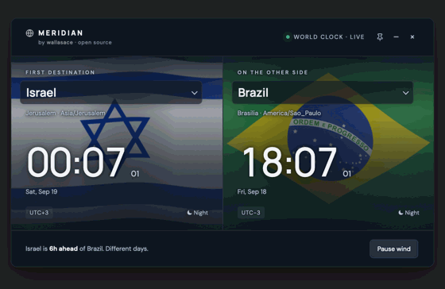

<div align="center">

# Meridian

**A world clock that puts two destinations side by side** — each with its own
flag waving behind the time, the current UTC offset, and how far apart the two are.



[**Open in your browser**](https://wallasace.github.io/meridian/) ·
[Download for desktop](https://github.com/wallasace/meridian/releases/latest) ·
[How it works](#how-its-put-together)

[](LICENSE)


</div>

Nothing to install to try it. Your browser can also keep it as a real app —
see [Install from the browser](#install-from-the-browser).

## What it does

- Live local time for two destinations, to the second, from one shared instant
- **200 countries and territories, 245 cities** — every country spanning several
  time zones lets you pick the city (Brazil has 8, the US 7, Russia 7)
- Handles daylight saving automatically, and offsets that aren't whole hours
  (Nepal is `UTC+5:45`, India `UTC+5:30`)
- Says the difference in plain words: *"Israel is 6h ahead of Brazil"*, and
  flags when the two are on different calendar days
- Search by country or city, accent-insensitive — typing `sao` finds São Paulo
- Flags wave like cloth; the motion can be paused, and it respects your system's
  reduced-motion setting
- Follows your light/dark theme
- Remembers your destinations, the wind setting and the pin between sessions

## Install from the browser

On the [live page](https://wallasace.github.io/meridian/):

| | |
|---|---|
| **Chrome / Edge** (Windows, Linux, macOS) | Click the install icon in the address bar, or menu → *Cast, save and share* → *Install page as app* |
| **Android** | Menu → *Add to Home screen* |
| **iPhone / iPad** | Share → *Add to Home Screen* |

It opens in its own window, with no address bar, and works offline after the
first visit. No download, no security warnings.

## Desktop apps

Native windows with no browser chrome — and a **pin** button that keeps the
clock above other windows, which the browser version cannot do.

Grab one from the [latest release](https://github.com/wallasace/meridian/releases/latest):

| System | File | First launch |
|---|---|---|
| macOS 11+ | `Meridian-macOS.zip` | Right-click the app → **Open** (once) |
| Windows 10/11 | `Meridian-Windows.zip` | **More info** → **Run anyway** (once) |
| Linux (GTK) | `Meridian-Linux.tar.gz` | `./install.sh` |

That extra click on the first launch is the unsigned-app warning. Code signing
certificates cost money every year and this project has none — the warning is
about a missing certificate, not about the app.

**Window controls:** 📌 keep on top · − minimize · × close (⌘W / Ctrl+W also
work). Drag the window by its header or footer.

## Building it yourself

The app itself is one file, `index.html`, and needs no build step at all — open
it and it runs. Each desktop wrapper is a thin native shell around it:

```bash
# macOS — needs Xcode command line tools
./desktop/macos/build.sh

# Windows — needs the .NET 8 SDK (winget install Microsoft.DotNet.SDK.8)
.\desktop\windows\build.ps1

# Linux — no build, just system packages
sudo apt install python3-gi gir1.2-webkit2-4.1   # Debian/Ubuntu
./desktop/linux/install.sh
```

Or let GitHub build all three: push a tag and the
[release workflow](.github/workflows/release.yml) compiles on macOS, Windows and
Linux runners and publishes the files.

```bash
git tag v1.0.0 && git push origin v1.0.0
```

## How it's put together

```
index.html              the whole app — layout, clocks, catalog, flag animation
manifest.webmanifest    lets browsers install it as an app
sw.js                   offline cache
icons/                  app icons
desktop/macos/          Swift + WebKit wrapper
desktop/windows/        C# + WebView2 wrapper
desktop/linux/          Python + GTK/WebKitGTK wrapper
```

All three wrappers speak the same four messages to the page — `close`,
`minimize`, `drag`, `pin` — so `index.html` carries no per-platform branches.

Time is computed with `Intl.DateTimeFormat` over IANA time zone identifiers, so
daylight saving and odd offsets come from the system's own tz database rather
than from hardcoded rules.

## Credits

- Flags — [flag-icons](https://github.com/lipis/flag-icons) by Panayiotis Lipiridis (MIT)
- Type — [Manrope](https://github.com/sharanda/manrope) by Mikhail Sharanda and
  [DM Sans](https://github.com/googlefonts/dm-fonts) by Colophon Foundry (both SIL OFL 1.1)
- Time zones — the [IANA time zone database](https://www.iana.org/time-zones),
  via the browser's `Intl` API
- Country codes — ISO 3166-1 alpha-2

## License

MIT — see [LICENSE](LICENSE). Built by [wallasace](https://github.com/wallasace).
